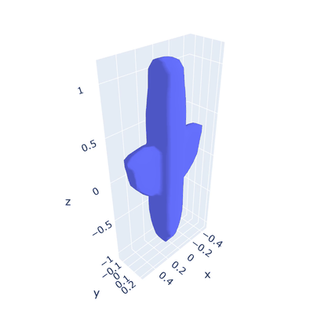

# Latent_ISP

This is an implementation of 'Solving Inverse Obstacle Scattering Problem with Latent Surface Representations" by Junqing Chen, Bangti Jin and Haibo Liu. See the paper [here]([https://arxiv.org/abs/2311.07187](https://iopscience.iop.org/article/10.1088/1361-6420/ad466a)).




# Citing Latent_ISP
If you use Latent_ISP in your research, please cite the [paper](https://arxiv.org/abs/2311.07187):
```
@article{chen2023solving,
  title={Solving inverse obstacle scattering problem with latent surface representations},
  author={Chen, Junqing and Jin, Bangti and Liu, Haibo},
  journal={Inverse Problems},
  year={2023}
}
```

# How to Use Latent_ISP

Following the steps below to run each case:

### 1. Install Latent_ISP

We suggest to use `conda` as the package manager and create a conda environment for this application.
``` bash
conda create --yes -n bempp python=3.8
conda install -n bempp --yes numpy scipy matplotlib numba scikit-image plotly git pip mpi4py pandas
conda install -n bempp --yes -c conda-forge pocl pyopencl meshio
```
Then activate this environment: `conda activate bempp`.

Next, install `bempp-cl`:
``` bash
pip install git+git://github.com/bempp/bempp-cl@v0.2.2
```

The installation will take several minutes on a normal workstation.

Next, install pytorch depending on your device. For example,
``` bash
pip3 install torch torchvision torchaudio
```

Next, clone the repo:
``` bash
git clone https://github.com/liuhaibogit/Latent_ISP.git
cd Latent_ISP
```

### 2. Training a DeepSDF Model
one could train the DeepSDF Model following https://github.com/facebookresearch/DeepSDF.git, and we have provided a trained neural network in the logs/DeepSDF_plane folder. The experiment_train model is trained with the training data, and the experiment_total is trained with the test data which is used only to generate the scattering data.


### 3. Run the script
``` bash
> python optimize/far_field_plane.py
```


# Team
Junqing Chen, Bangti Jin, Haibo Liu


